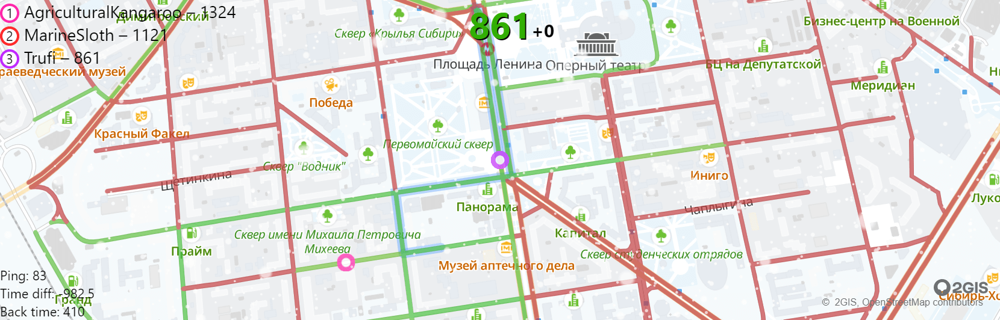

# snow-cleaning

The multiplayer game about cleaning snow in the city (work in progress).



[Play game](https://snow.trufi.art/)

## Using

### Development

```sh
npm install
npm run dev
```

### Production

```sh
npm run build
npm start
```

### Configuration

To set up the whole project, you need to configure their URLs with `.env` config.

For example:

```sh
# To change main server
MAIN_SERVER_URL=http://localhost:3002

# To change public game websocket server URL
PUBLIC_WS_URL=localhost:3001

# To change URL to data assets
ASSETS_URL=localhost:3000
```
